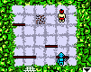
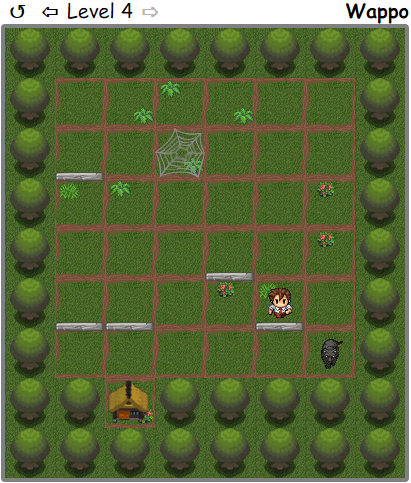

Wappo is a "simple" puzzle game. You need to escape from an enemy, having taken cover in the house.

  
Do you remember this game from old siemens?

  

There are very few rules:
* the player walks 1 square in every turn, enemies - 2.
* enemies always go straight to the player by the shortest way.
* enemies are always trying to make a horizontal step first, if not possible, they will make a vertical step.

Play on [http://nagits.github.io/Wappo](http://nagits.github.io/Wappo).
